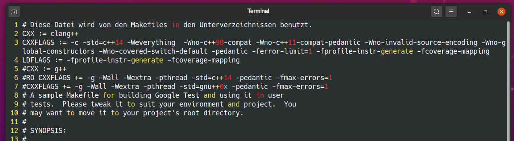

# Clang Coverage

LLVM is a compiler infrastructure. clang is a compiler, the frontend of LLVM, and an alternative to gcc/g++.

### Installation 

We are using Ubuntu 20.04.1. LLVM and clang are also available on other systems like Windows and mac. However, we don't provide installation instructions for windows and mac.
~~~console
apt-get update
apt-get install -y clang
~~~

This installs not only the clang compiler, but also other LLVM tools, e.g. the clang coverage tools. These clang coverage tools are used in the following sections.

### Compiling with coverage enabled

We need to change the compiler from g++ to clang++ and add compiler and linker flags.

In the LeanTestingBeispiele examples, these can be configured in the './LeanTestingBeispiele/include.mf' file. Open this file and modify the file as follows:
- Comment out the following lines:
	- Line 4: 'CXX := g++'
	- Line 6: 'CXXFLAGS += -g -Wall -Wextra -pthread -std=gnu++0x -pedantic -fmax-errors=1'
- Uncomment the following lines:
	- Line 2: 'CXX := clang++'
	- Line 3: 'CXXFLAGS := -c -std=c++14 -Weverything  -Wno-c++98-compat -Wno-c++11-compat-pedantic -Wno-invalid-source-encoding -Wno-global-constructors -Wno-covered-switch-default -pedantic -ferror-limit=1'
- Append ' -fprofile-instr-generate -fcoverage-mapping' (without "'") to the CXXFLAGS (Line 3)
- Add a new line, for example after line 3, with the content 'LDFLAGS := -fprofile-instr-generate -fcoverage-mapping' (without "'")

The result should look like this:

This will add coverage instrumentation to the binary. If a coverage instrumented binary is executed, a so-called profile file is created. This profile file contains information about the reached coverage of the execution.

### Compile and execute a instrumented binary

In the 'LeanTestingBeispiele' folder, execute 'make clean && make'. The created binaries are instrumented now. In this example, we use the binary in the 'taxi1' folder. The process is the same for the other binaries created with 'make'.

Follow the following steps in the terminal:
- Run 'cd ./taxi1'
- Run './dertest'. This creates the profile file called 'default.profraw' in the 'taxi1' folder. You can optionally specify the name of the profile file with the 'LLVM\_PROFILE\_FILE' environment variable. For example with 'LLVM\_PROFILE\_FILE="foo.profraw" ./dertest', the created profile file is 'foo.profraw'.
- Run 'llvm-profdata-10 merge -sparse default.profraw -o default.profdata'. The '10' in 'llvm-profdata-10' is the version of llvm. If you are using e.g. an older version of ubuntu, you might have installed 'llvm-profdata-9' or 'llvm-profdata-8' instead of 'llvm-profdata-10'. The command line flags for older versions are the same, just change '...-10' to your version in this and the following commands. As a side note: LLVM creates a separate profile file for each './dertest' binary execution. 'llvm-profdata-10 merge' can be used to combine multiple profile files to later generate a report of the combined coverage reached in multiple individual './dertest' binary executions. In other words, the merged profile file 'default.profdata' contains the information about the coverage reached by one or multiple individual profile files.
- Run 'llvm-cov-10 show ./dertest -instr-profile=default.profdata -format=html > coverage.html' to create a 'coverage.html' file. Open this file in your favorite browser. There are many alternatives to generating an html file. For example you can run 'llvm-cov-10 report ./dertest -instr-profile=default.profdata' to get a quick overview. The interested reader can see [here](https://llvm.org/docs/CommandGuide/llvm-cov.html) for more information.

